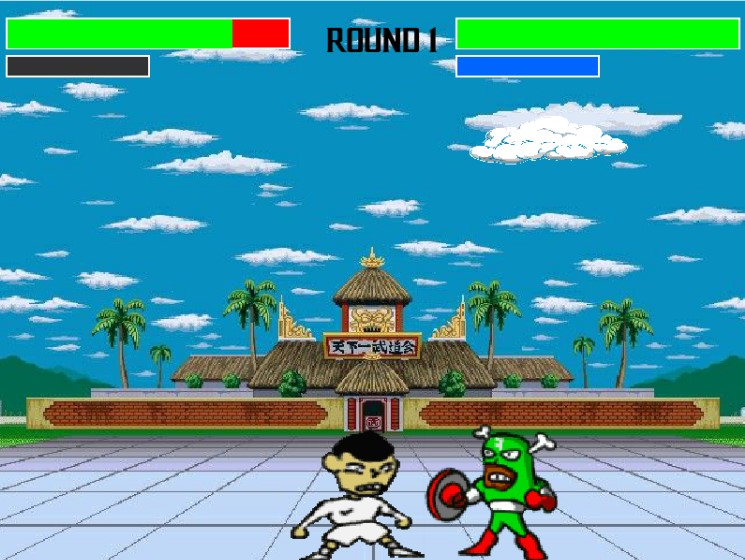

# OOP Game - Street Fighter Style

A project developed by [@dedez1nn](https://github.com/dedez1nn) and [@GabryelDEVNewton](https://github.com/GabryelDEVNewton) for the **Object-Oriented Programming** subject in college, using **Python 3** and **Pygame**.

---

## 🎮 Project Description

This is a small fighting game inspired by **Street Fighter**, developed as our first project using **OOP in Python**.  
The goal of the project was to implement:

- ✅ Enemies with **two different behaviors**  
- ✅ **Two independent elements** in the scenario  
- ✅ **Sound effects** triggered by one or more actions  
- ✅ **OOP pillars**: inheritance, polymorphism, operator overloading, and exception handling  

We had **1 month** to develop it from scratch, and we are happy with the project!  
There is still a lot to improve, but it's a solid start as our **first Python and Pygame project**.

---

## 🖼️ Screenshot



---

## ⚙️ Requirements

- **Python 3.x**  
- **Pygame** (`pip install pygame`)

---

## 🚀 How to Run

### On **Windows** (Git Bash)
1. Open the folder containing the game.  
2. Right click → **Open Git Bash Here**  
3. Run:  
   ```bash
   make

---

## 🎨 Assets Credits

All character sprites and visual assets used in this game were taken from **Mighty Fighter 2**, available at:  
🔗 [The Spriters Resource - Mighty Fighter 2](https://www.spriters-resource.com/mobile/mightyfighter2/)

These sprites are **property of their respective owners** and were used **only for educational purposes**, not for commercial distribution.

---

## 👨‍💻 Authors

- [@dedez1nn](https://github.com/dedez1nn)  
- [@GabryelDEVNewton](https://github.com/GabryelDEVNewton)
